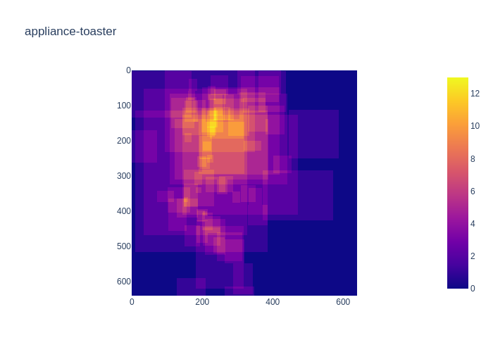

# Learn Coco Dataset

Learn Coco Dateset with its annotations.

## How to Use

### Overlook

Overlook the dataset.
We will count the categories for every pixels,
and draw heatmap graphs for the counts.

-   Download the annotations of [Coco](https://cocodataset.org/ "Coco") dataset;
-   Put them into the folder of `annotations`;
-   The `overlook.py` script will automatically count the histogram of objects' bbox in the annotations.
-   The results will be saved into the folder of `largeFiles`.

### Probability Analysis

Statistic the prior probabilities of categories,
and posterior probabilities between each two categories.

-   The `prob_analysis.py` script will compute the probability of categories,
    it will also compute the posterior probability between each two categories.

### Category Space Analysis

Use PCA and TSNE method to project the samples into regularized 3D space,
the features are their categories vector in hot-encoding format.

-   The `category_space_analysis.py` script will do the computation.

## Visualize

You will get images like these

-   Count heat map of Occlude

    

-   Histogram of categories

    

-   Box graph of objects' area

    

-   The base probabilities of categories

    

-   The posterior probabilities of each two categories

    
